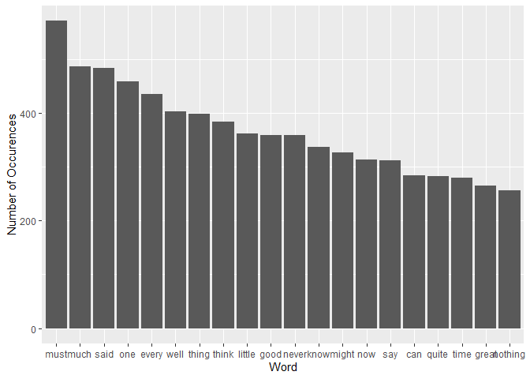

STAT 545 Assignment B4
================
Thomas Deckers
13/11/2023

    ## Warning: package 'janeaustenr' was built under R version 4.3.2

    ## Warning: package 'stopwords' was built under R version 4.3.2

# STAT 545 Assignment B4 option A: Strings and Functional Programming

## Exercise 1: Word counts in Jane Austen

### Intro

For this exercise, we’d like to make a plot of the most common words
appearing in Jane Austen’s *Emma*, exluding stopwords such as “the”,
“a”, and “and”.

### Data

Let’s inspect the data, provided by the `janeaustenr` package:

``` r
typeof(emma)
```

    ## [1] "character"

``` r
head(emma, n = 16)
```

    ##  [1] "EMMA"                                                                
    ##  [2] ""                                                                    
    ##  [3] "By Jane Austen"                                                      
    ##  [4] ""                                                                    
    ##  [5] ""                                                                    
    ##  [6] ""                                                                    
    ##  [7] ""                                                                    
    ##  [8] "VOLUME I"                                                            
    ##  [9] ""                                                                    
    ## [10] ""                                                                    
    ## [11] ""                                                                    
    ## [12] "CHAPTER I"                                                           
    ## [13] ""                                                                    
    ## [14] ""                                                                    
    ## [15] "Emma Woodhouse, handsome, clever, and rich, with a comfortable home" 
    ## [16] "and happy disposition, seemed to unite some of the best blessings of"

As we can see, we have a character array, where each entry is a line of
the text.

Our other input is the list of stopwords from the `stopwords` package.

``` r
stopwds <- stopwords("en")

typeof(stopwds)
```

    ## [1] "character"

``` r
head(stopwds)
```

    ## [1] "i"      "me"     "my"     "myself" "we"     "our"

This is stored in a very similar format.

### Proprocessing

First things first, we want to transform the format of emma into an
array of individual words. This will require first removing the empty
elements, and all the punctuation.

``` r
my_emma <- emma %>%
  str_replace_all("[:punct:]|[:symbol:]|[:digit:]", " ") %>% # Remove punctuation, numbers, and symbols
  tolower() %>% # Remove all capitalization
  str_split(" ") %>% # Split on the words
  flatten() %>% # Remove the lines as they previously were
  unlist() # make it a character array

#lastly, remove the empty entries
my_emma <- my_emma[my_emma != ""] # Remove the blank lines

head(my_emma, n = 30)
```

    ##  [1] "emma"        "by"          "jane"        "austen"      "volume"     
    ##  [6] "i"           "chapter"     "i"           "emma"        "woodhouse"  
    ## [11] "handsome"    "clever"      "and"         "rich"        "with"       
    ## [16] "a"           "comfortable" "home"        "and"         "happy"      
    ## [21] "disposition" "seemed"      "to"          "unite"       "some"       
    ## [26] "of"          "the"         "best"        "blessings"   "of"

Here, I replaced punctuation with spaces. This occasionally divides
words which are arguably a single word, such as “twenty-one”, and
“long-standing”. The easy alternative is to remove punctuation outright.
However, this creates the issue that words that are only separated by
punctuation marks—most commonly an emdash in this text—end up being
treated as one word. To deal with both of these issues would require a
complicated context-dependent algorithm, but for now I’ll take the
lesser of two evils.

### Counting and filtering

Now we need to generate a count. Luckily, dplyr provides a convenient
function for this. After this we can easily select based on the list of
stopwords.

``` r
emma_counts <- tibble("word" = my_emma) %>%
  count(word)

emma_counts <- emma_counts %>%
  filter(!word %in% stopwords("en")) %>%
  arrange(desc(n))

head(emma_counts, n = 10)
```

    ## # A tibble: 10 × 2
    ##    word        n
    ##    <chr>   <int>
    ##  1 mr       1154
    ##  2 s         933
    ##  3 emma      865
    ##  4 mrs       701
    ##  5 miss      602
    ##  6 must      571
    ##  7 harriet   506
    ##  8 much      486
    ##  9 said      484
    ## 10 one       458

We can see a few things that are not great here. “Mr,” “Ms”, “Mrs”,
“Miss”, “Harriet”, and “Emma” all come from addressing characters. This
doesn’t really tell us much about Austen’s word choice. Then of course,
“s” shows up from contractions where the apostrophe was replaced with a
space. Let’s remove all of this as well, along with some more proper
nouns that turn up near the top.

``` r
manual_word_blacklist <- c("mr", "s", "mrs", "miss", "harriet", "emma",
                           "weston", "knightley", "elton", "woodhouse", "jane",
                           "fairfax", "churchill", "hartfield", "frank")

emma_counts <- emma_counts %>%
  filter(!word %in% manual_word_blacklist)

head(emma_counts, n = 20)
```

    ## # A tibble: 20 × 2
    ##    word        n
    ##    <chr>   <int>
    ##  1 must      571
    ##  2 much      486
    ##  3 said      484
    ##  4 one       458
    ##  5 every     435
    ##  6 well      403
    ##  7 thing     399
    ##  8 think     384
    ##  9 little    361
    ## 10 good      359
    ## 11 never     358
    ## 12 know      337
    ## 13 might     326
    ## 14 now       313
    ## 15 say       312
    ## 16 can       284
    ## 17 quite     282
    ## 18 time      280
    ## 19 great     265
    ## 20 nothing   256

There’s another approximation that has to be made here. Emma contains a
character named “Frank”. Presumably, a large share of the occurrences of
the word “frank” refers to this character as opposed to the English
noun, so I am removing it from the list. However, we do also lose any
usage of the noun. A more sophisticated approach might have used regex
to match lower case occurences of the word “frank”, although this still
would have missed instances that occur at the start of the sentence.

### Plotting

The simplest way to view this is as a column plot of the top few words.

``` r
emma_counts %>% head(n=20) %>%
  mutate(word = factor(word, levels = word)) %>%
  ggplot(aes(x=word, y=n)) +
  geom_col() +
  labs(x = "Word", y = "Number of Occurences")
```

<!-- -->
